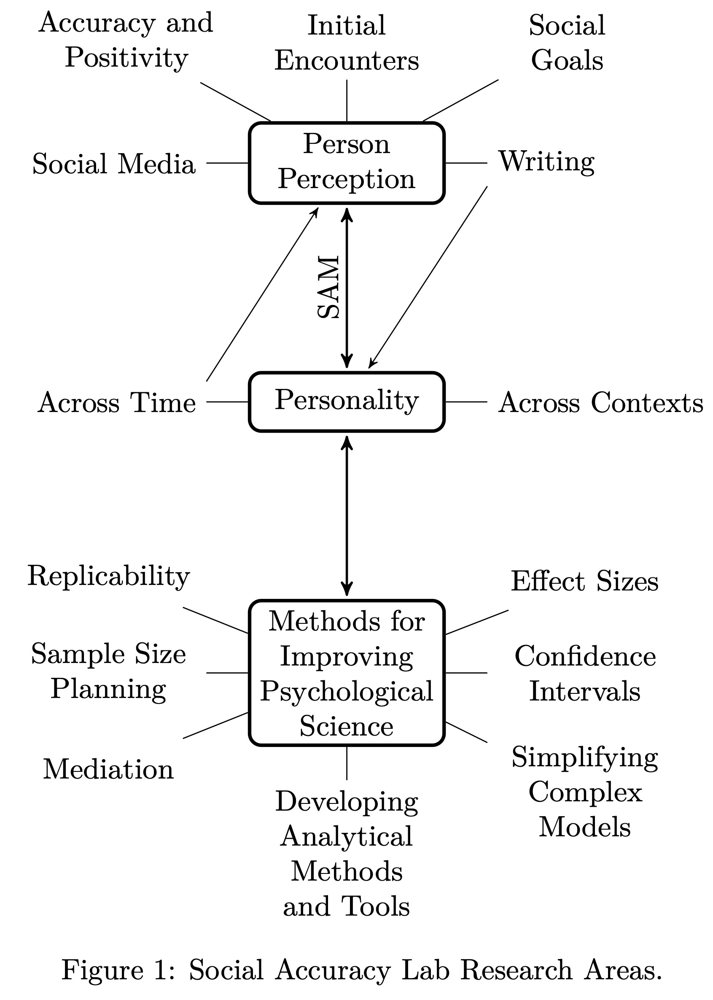

```{r setup, include=FALSE}
knitr::opts_chunk$set(echo = FALSE)
```

:::float-image

```{r out.width='350px', out.extra='style="float:left; padding:10px"', echo=FALSE}

```

**Research Areas**

Research in SAL falls into 3 broad categories. First are questions about accuracy and bias in person perception using the Social Accuracy Model [(SAM)](https://socialaccuracy.com/social-accuracy-model.html). For instance, when, why, and how are first impressions of others more or less accurate? Are some people more likeable than others and what are the consequences of likeability? Second, what is the nature and structure of personality?  How can we better assess basic personality traits and dimensions? How does personality manifest over time? Finally, we are interested in developing, improving, and disseminating better quantitative tools for substantive researchers to improve the practice of psychological science.
:::


### Accuracy and Bias

We are currently examining the overall levels, variability, and the interrelationships between multiple forms of accuracy and bias. Although accuracy and biases such as assumed similarity and self-enhancement have long research histories, rarely have these processes been studied simultaneously, nor have there been adequate techniques to directly compare the variability and relationships between these processes. Utilizing SAM, we are able to examine the extent to which bias and accuracy are interrelated or opposing processes.

### Motivation

We have also been exploring whether social goals, such as the motivation to form more accurate impressions, can improve the accuracy of impressions. Indeed, it does appear that motivated perceivers are better able to perceive the unique characteristics of others. This comes at the cost, however, of viewing others less normatively, and, in turn, less positively [@biesanz2010cost]. We are interested further exploring the links between normative accuracy, positivity, and social relationships, to better understand the implications of this reduction in normative accuracy.

### Adjustment

One major line of research in our lab investigates how well-adjusted individuals, those with effective personal and interpersonal functioning, perceive others and tend to be perceived by others [@human2011target; @Wallace2021]. 


### Acquaintanceship

Another line of research has investigated whether accuracy improves with greater acquaintanceship. That is, do we come to know others better the longer we know them? Although overall accuracy doesn’t appear to improve over time, this is because with greater acquaintanceship distinctive accuracy increases but normative accuracy decreases [@biesanz2007]. Thus the longer we know someone, we better understand their unique characteristics while perceiving them as less similar to what people are like in general. To replicate this finding longitudinally, we are currently examining how new roommates’ impressions of one another change over time.

### Impression Management

Even without any deliberate effort on our part, others are able to form rather accurate impressions about us. But what about when we try to make a specific impression on others? One of our lines of research is examining how self-presentation, or “putting one’s best face forward”, impacts the accuracy of impressions. So far, we have found that individuals’ engaging in self-presentation are actually more accurately perceived than those who are not, primarily because they appear to elicit greater attention from others [@human2012your].

### Quantitative Methods and Research

My current quantitative research is quite diverse with the unifying theme of focusing on topics that require additional attention --- in other words, building better quantitative tools for common problems faced by applied researchers. Recent examples include (1) novel approaches to examining mediational models [@Biesanz2010Mediation; @falk2015inference; @falk2016two], (2) sample size planning based on effect size estimates (in progress), and (3) generating confidence intervals for standardized effect size estimates based on both fixed and random predictors (in progress). Currently I am in the process of developing and expanding a package for R [fabs](https://github.com/jbiesanz/fabs) that will serve as a repository of my quantitative work and code for these various endeavours. [fabs](https://github.com/jbiesanz/fabs) is currently available on github and will soon be submitted as a package on CRAN.

<aside>
To install fabs, download the `devtools` package in R and then run the following code:

<span style="color: blue;">library</span>(devtools)\
install_github("<span style="color: green;">jbiesanz/fabs</span>")\
<span style="color: blue;">library</span>(fabs)
</aside>
