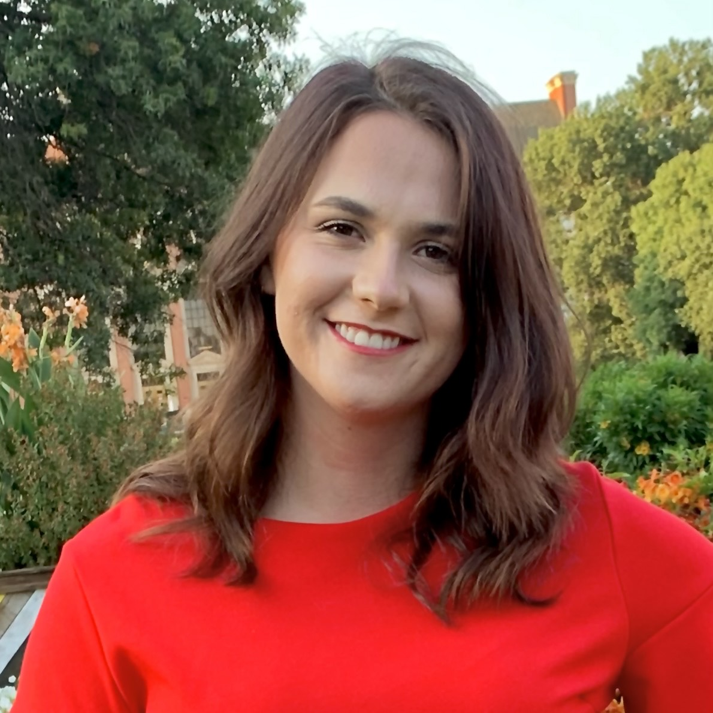

```{r setup, include=FALSE}
knitr::opts_chunk$set(echo = FALSE)
```


**Dr. Jeremy Biesanz**\
I have developed and pursued several lines of research in personality and person perception and quantitative methodology. The broad substantive questions that interest me include how and why do individuals differ in the expression of their personality? What impact does this have on the social perception of personality --- the impressions that others form? When we form impressions, what is the impact of our own expectations and motivations? Is there a good judge of personality? In other words, are some people better able to see the personality of others? Although these are the substantive questions I am pursuing, the lack of adequate quantitative methodology has hampered research in these areas.

<aside>
```{r , echo=FALSE}

```
</aside>

--------

**Jessica Stewart**\
Jessica is a PhD Candidate in the Health Psychology area interested in personality, interpersonal perception, expressive writing and their relation with health. Her research focuses on understanding who is likeable, what makes someone likeable, and the long-term consequences of being liked by others. 

<aside>
```{r , echo=FALSE}

```
</aside>

--------

**Malina Lemmons**\
Malina is a MA student in Quantitative Psychology starting in Fall 2022 with interests in best practices in research. Her research focuses on power analysis and sample size planning. 


<aside>
```{r , echo=FALSE}

```
</aside>


--------

**Raymond Li**\
Raymond is a 4<sup>th</sup> year undergraduate student majoring in psychology and minoring in statistics. His research interests include using machine learning methods such as topic modeling to reveal novel insights into how people develop impressions of others based upon their writing.


<aside>
```{r , echo=FALSE}

```
</aside>
--------

**Lab Alumni**

+ [Dr. Lauren Human](https://laurenhuman.com/)
+ [Dr. Katherine Rogers](https://www.zillow.com/research/about-us/kate-rogers/)
+ [Dr. Meanne Chan](https://www.ln.edu.hk/wjlccprc/professor-meanne-chan)
+ [Dr. Marina Le](https://www.psychologists.bc.ca/user/38128)
+ [Carly Magee](https://socialexposome.ubc.ca/people/trainees/carly-magee)
+ [Sam Kristen Can](https://ca.linkedin.com/in/samkristencan?original_referer=https%3A%2F%2Fwww.google.com%2F)


